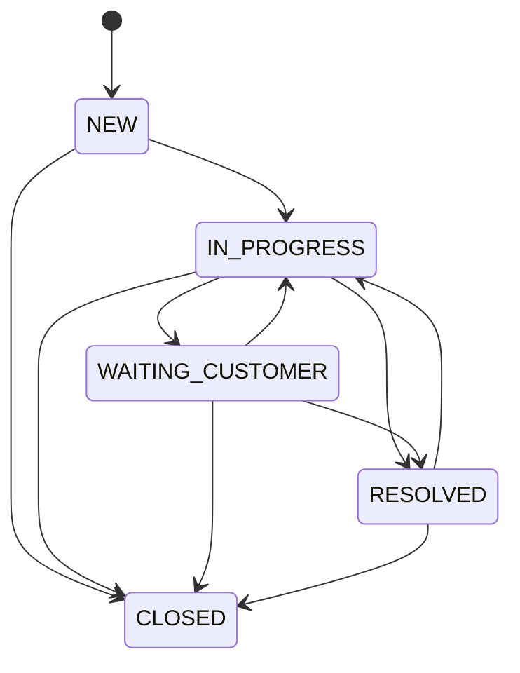

# Query Management

A lightweight query management application in Python. It stores customer queries in a JSON file, enforces a workflow, and can output the workflow graph in Mermaid/DOT/text formats.

## Workflow



You can also print the workflow from the CLI:

```bash
python -m query_management.cli workflow --format mermaid
python -m query_management.cli workflow --format dot
```

## Usage

All commands accept `--data-file` to override the storage location (default: `data/queries.json`).

```bash
python -m query_management.cli create \
  --customer "Acme" \
  --subject "Login issue" \
  --description "User cannot log in" \
  --priority HIGH

python -m query_management.cli list
python -m query_management.cli show <query_id>

python -m query_management.cli update-status <query_id> IN_PROGRESS
python -m query_management.cli add-response <query_id> "We are investigating" --author "Support"
```
